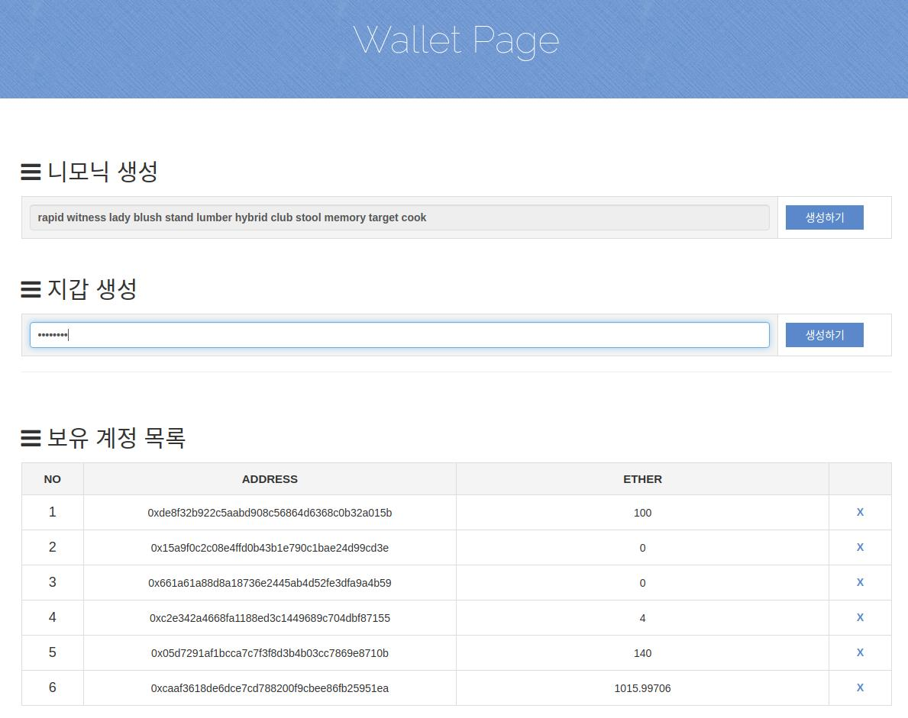
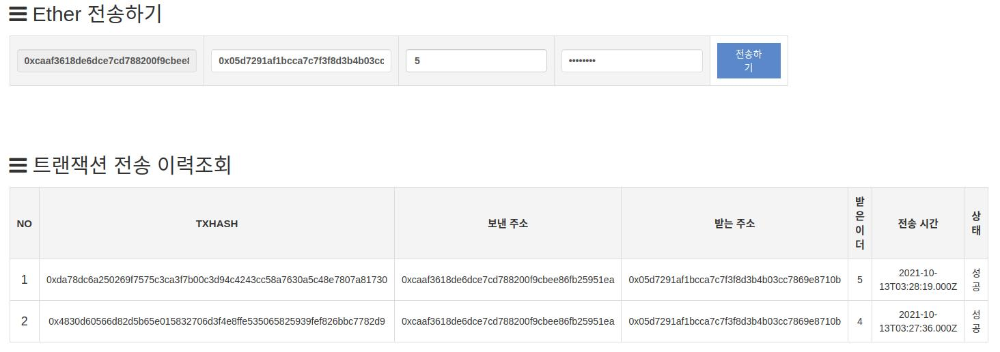
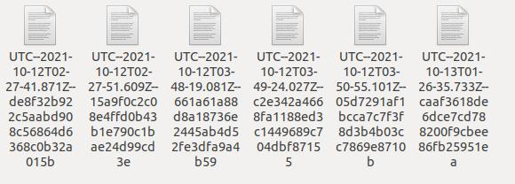

# 블록체인 Wallet 구현
## 기능
* 니모닉 생성
* keystore file 생성 및 삭제
* 유저 정보 DB 저장(id, password, address, UTC_file_path)
* 유저 keystore file 및 비밀번호를 통한 privatekey 추출 후 서명 및 트랜잭션 전송
* 트랜잭션 전송 이력 저장 및 조회

## 관련 이미지

 

 

 

